<h2 align="center">
    <a href="https://dainam.edu.vn/vi/khoa-cong-nghe-thong-tin">
    🎓 Faculty of Information Technology (DaiNam University)
    </a>
</h2>
<h2 align="center">
    PLATFORM ERP
</h2>
<div align="center">
    <p align="center">
        
        
        
    </p>

[](https://www.facebook.com/DNUAIoTLab)
[](https://dainam.edu.vn/vi/khoa-cong-nghe-thong-tin)
[](https://dainam.edu.vn)

</div>

---

## 📖 1. Giới thiệu dự án

### 1.1. Tổng quan

Platform ERP là hệ thống quản trị nguồn lực doanh nghiệp được xây dựng dựa trên nền tảng mã nguồn mở Odoo, phát triển trong khuôn khổ học phần Thực tập doanh nghiệp tại Khoa Công nghệ Thông tin - Trường Đại học Đại Nam.

Hệ thống được thiết kế để giải quyết các bài toán quản trị nội bộ và tương tác khách hàng cho các doanh nghiệp vừa và nhỏ, đặc biệt trong lĩnh vực công nghệ và IoT. Platform ERP không chỉ là một hệ thống quản lý truyền thống mà còn tích hợp các công nghệ trí tuệ nhân tạo (AI) hiện đại để tự động hóa các quy trình xử lý văn bản, tài liệu và nâng cao hiệu quả vận hành.

<div align="center" style="margin-top: 15px; margin-bottom: 15px;">
    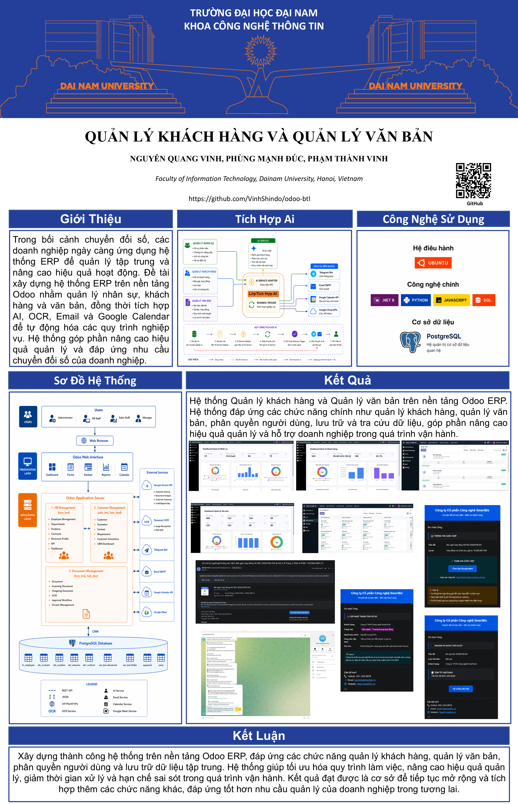
</div>

### 1.2. Mục tiêu

- Xây dựng hệ thống ERP toàn diện với 3 module cốt lõi: Quản lý nhân sự, Quản lý khách hàng và Quản lý văn bản
- Tích hợp trí tuệ nhân tạo (AI) vào quy trình xử lý tài liệu thông qua OCR, tóm tắt văn bản, phân loại và trích xuất metadata
- Tự động hóa các quy trình nghiệp vụ từ tạo báo giá, hợp đồng đến phê duyệt văn bản
- Cung cấp giao diện trực quan với các dashboard thông minh hiển thị KPI và chỉ số hoạt động
- Đảm bảo khả năng mở rộng và tùy chỉnh cho các nhu cầu doanh nghiệp đa dạng

### 1.3. Phạm vi

Bộ code tập trung triển khai ba module chính:

- **`nhan_su`**: Quản lý nhân sự bao gồm phòng ban, chức vụ, hồ sơ nhân viên và phân công dự án IoT
- **`quan_ly_khach_hang`**: Quản lý khách hàng, báo giá, hợp đồng và lịch sử tương tác
- **`quan_ly_van_ban`**: Quản lý văn bản/tài liệu, phân loại, thư mục, phiên bản và quy trình phê duyệt

File `insert_data.sql` kèm theo cung cấp tập dữ liệu mẫu để khởi tạo và kiểm thử các chức năng chính của ba module trên. Các trường cần AI tổng hợp hoặc dữ liệu bổ sung được để trống hoặc có giá trị mẫu, bạn có thể điều chỉnh sau khi nạp dữ liệu vào cơ sở dữ liệu.

---

## 🏗️ 2. Tổng quan hệ thống

### 2.1. Kiến trúc tổng thể

Hệ thống Platform ERP được xây dựng theo kiến trúc 3 lớp (3-tier architecture) với các thành phần chính:

1. **Presentation Layer (Tầng giao diện)**
   - Giao diện Web dựa trên Odoo Framework
   - Dashboard thông minh với biểu đồ và KPI trực quan
   - Responsive design hỗ trợ đa thiết bị

2. **Business Logic Layer (Tầng xử lý nghiệp vụ)**
   - Các module Odoo xử lý logic nghiệp vụ
   - ORM (Object-Relational Mapping) quản lý dữ liệu
   - Workflow engine xử lý luồng phê duyệt
   - AI Integration Layer xử lý văn bản thông minh

3. **Data Access Layer (Tầng truy xuất dữ liệu)**
   - PostgreSQL Database Server
   - File storage cho tài liệu đính kèm
   - Redis cache cho hiệu suất cao

<div align="center">
    
</div>

**Mô tả chi tiết kiến trúc:**

Sơ đồ trên minh họa các thành phần chính của hệ thống:

- **Odoo Application Layer (Addons)**: Lớp ứng dụng chứa các module nghiệp vụ, xử lý logic, quản lý workflow và cung cấp API endpoints
- **PostgreSQL Database**: Cơ sở dữ liệu quan hệ lưu trữ toàn bộ dữ liệu nghiệp vụ
- **Dịch vụ OCR/AI**: Hệ thống xử lý văn bản thông minh, có thể triển khai cục bộ hoặc trên cloud
- **Hệ thống ngoại biên**: Kết nối tới các dịch vụ bên ngoài như Google Meet, Web APIs, Email Server, Telegram Bot

### 2.2. Kiến trúc tích hợp AI và API

<div align="center">
    
</div>

**Mô tả chi tiết luồng tích hợp AI:**

Sơ đồ cho thấy luồng dữ liệu xử lý từ tài liệu đầu vào đến kết quả đầu ra:

| Bước | Thành phần | Chức năng | Đầu vào | Đầu ra |
|------|-----------|-----------|---------|--------|
| 1 | **Upload File** | Người dùng tải lên tài liệu (PDF, hình ảnh, Word) | File từ client | Document object trong Odoo |
| 2 | **OCR Service** | Trích xuất văn bản từ file ảnh/PDF | File path | OCR Text |
| 3 | **Preprocessing** | Tiền xử lý văn bản, làm sạch dữ liệu | Raw OCR text | Clean text |
| 4 | **AI Processing** | Tóm tắt, phân loại, trích xuất metadata | Clean text | Summary, Category, Metadata |
| 5 | **Odoo Database** | Lưu kết quả AI vào model `van_ban.document` | AI results | Database records |
| 6 | **Auto Routing** | Kích hoạt luồng xử lý tự động | Document data | Workflow instance |
| 7 | **Notifications** | Gửi thông báo qua Email/Telegram | Workflow events | Notifications |

### 2.3. Quan hệ giữa các module

Hệ thống PLATFORM ERP được thiết kế theo kiến trúc module độc lập (Modular Architecture) của Odoo. Mỗi module đảm nhiệm một nhóm nghiệp vụ riêng nhưng vẫn có khả năng trao đổi dữ liệu và phối hợp xử lý thông qua cơ sở dữ liệu PostgreSQL và cơ chế ORM của Odoo. Điều này giúp các module có thể phát triển độc lập, dễ dàng mở rộng và tích hợp thêm các chức năng mới trong tương lai.

<div align="center">
    
</div>

Ba module hoạt động độc lập về mặt chức năng nhưng được tích hợp trên cùng một nền tảng ERP, cho phép dữ liệu được chia sẻ và sử dụng xuyên suốt giữa các quy trình nghiệp vụ. Thay vì liên kết chặt chẽ thông qua nhiều khóa ngoại giữa các bảng dữ liệu, hệ thống tận dụng cơ chế ORM của Odoo để đồng bộ thông tin và đảm bảo tính nhất quán của dữ liệu.

**Quan hệ nghiệp vụ giữa các module**

- **Module Quản lý nhân sự ↔ Module Quản lý khách hàng**

  Thông tin nhân viên được sử dụng trong các nghiệp vụ chăm sóc khách hàng, lập báo giá, ký kết hợp đồng và quản lý lịch hẹn. Mỗi khách hàng hoặc hợp đồng đều có thể được gán cho một nhân viên phụ trách nhằm theo dõi trách nhiệm và đánh giá hiệu quả làm việc.

- **Module Quản lý nhân sự ↔ Module Quản lý văn bản**

  Nhân viên là đối tượng trực tiếp tham gia vào vòng đời của văn bản, từ khâu tạo lập, tiếp nhận, chỉnh sửa, lưu trữ đến phê duyệt. Hệ thống sử dụng thông tin đơn vị, chức vụ và quyền hạn của nhân viên để xác định luồng xử lý và phân quyền đối với từng loại văn bản.

- **Module Quản lý khách hàng ↔ Module Quản lý văn bản**

  Trong quá trình giao dịch với khách hàng, nhiều tài liệu như báo giá, hợp đồng hoặc các văn bản trao đổi được sinh ra và quản lý trong module văn bản. Điều này giúp toàn bộ hồ sơ giao dịch được lưu trữ tập trung, dễ dàng tra cứu và theo dõi lịch sử làm việc với từng khách hàng.

- **Ba module trên nền tảng Odoo**

  Tất cả các module cùng sử dụng cơ sở dữ liệu PostgreSQL và cơ chế ORM của Odoo để quản lý dữ liệu. Cách thiết kế này đảm bảo tính nhất quán, hạn chế trùng lặp dữ liệu và tạo điều kiện thuận lợi cho việc mở rộng thêm các module nghiệp vụ mới mà không ảnh hưởng đến các chức năng hiện có.

---

## 🔧 3. Các công nghệ được sử dụng

<div align="center">

### Hệ điều hành
[](https://ubuntu.com/)
### Công nghệ chính
[](https://www.odoo.com/)
[](https://www.python.org/)
[](https://developer.mozilla.org/en-US/docs/Web/JavaScript)
[](https://www.w3.org/XML/)
### Cơ sở dữ liệu
[](https://www.postgresql.org/)
</div>

---

## ⚙️ 4. Cài đặt

### 4.1. Cài đặt công cụ, môi trường và các thư viện cần thiết

#### 4.1.1. Tải project.
```
git clone https://github.com/FIT-DNU/Business-Internship.git
```
#### 4.1.2. Cài đặt các thư viện cần thiết
Người sử dụng thực thi các lệnh sau đề cài đặt các thư viện cần thiết

```
sudo apt-get install libxml2-dev libxslt-dev libldap2-dev libsasl2-dev libssl-dev python3.10-distutils python3.10-dev build-essential libssl-dev libffi-dev zlib1g-dev python3.10-venv libpq-dev
```
#### 4.1.3. Khởi tạo môi trường ảo.
- Khởi tạo môi trường ảo
```
python3.10 -m venv ./venv
```
- Thay đổi trình thông dịch sang môi trường ảo
```
source venv/bin/activate
```
- Chạy requirements.txt để cài đặt tiếp các thư viện được yêu cầu
```
pip3 install -r requirements.txt
```
### 4.2. Setup database

Khởi tạo database trên docker bằng việc thực thi file dockercompose.yml.
```
sudo docker-compose up -d
```
### 4.3. Setup tham số chạy cho hệ thống
Tạo tệp **odoo.conf** có nội dung như sau:
```
[options]
addons_path = addons
db_host = localhost
db_password = odoo
db_user = odoo
db_port = 5431
xmlrpc_port = 8069
```
Có thể kế thừa từ file **odoo.conf.template**
### 4.4. Chạy hệ thống và cài đặt các ứng dụng cần thiết
Lệnh chạy
```
python3 odoo-bin.py -c odoo.conf -u all
```
Người sử dụng truy cập theo đường dẫn _http://localhost:8069/_ để đăng nhập vào hệ thống.

---

## 📂 5. Cấu trúc source code

```
Business-Internship/
├── addons/                              # Thư mục chứa các module Odoo
│   ├── nhan_su/                         # Module Quản lý nhân sự
│   │   ├── models/
│   │   │   ├── __init__.py
│   │   │   ├── phong_ban.py             # Model Phòng ban
│   │   │   ├── chuc_vu.py               # Model Chức vụ
│   │   │   ├── nhan_vien.py             # Model Nhân viên
│   │   │   └── du_an_iot.py             # Model Dự án IoT
│   │   ├── views/
│   │   │   ├── phong_ban_view.xml
│   │   │   ├── chuc_vu_view.xml
│   │   │   ├── nhan_vien_view.xml
│   │   │   └── du_an_iot_view.xml
│   │   ├── security/
│   │   │   └── ir.model.access.csv      # Phân quyền
│   │   ├── data/
│   │   │   └── demo_data.xml            # Dữ liệu mẫu
│   │   ├── __manifest__.py              # Khai báo module
│   │   └── __init__.py
│   ├── quan_ly_khach_hang/              # Module Quản lý khách hàng
│   │   ├── models/
│   │   │   ├── __init__.py
│   │   │   ├── khach_hang.py            # Model Khách hàng
│   │   │   ├── quotation.py             # Model Báo giá
│   │   │   ├── contract.py              # Model Hợp đồng
│   │   │   └── lich_hen.py              # Model Lịch hẹn
│   │   ├── views/
│   │   │   ├── khach_hang_view.xml
│   │   │   ├── quotation_view.xml
│   │   │   ├── contract_view.xml
│   │   │   └── lich_hen_view.xml
│   │   ├── security/
│   │   ├── data/
│   │   ├── __manifest__.py
│   │   └── __init__.py
│   └── quan_ly_van_ban/                 # Module Quản lý văn bản
│       ├── models/
│       │   ├── __init__.py
│       │   ├── document.py              # Model Tài liệu
│       │   ├── van_ban_den.py           # Model Văn bản đến
│       │   ├── van_ban_di.py            # Model Văn bản đi
│       │   ├── loai_van_ban.py          # Model Loại văn bản
│       │   ├── version.py               # Model Phiên bản
│       │   ├── approval.py              # Model Phê duyệt
│       │   └── routing.py               # Model Routing
│       ├── views/
│       ├── security/
│       ├── data/
│       ├── __manifest__.py
│       └── __init__.py
├── docs/                                # Tài liệu dự án
│   ├── logo/                            # Logo các đơn vị
│   ├── business-flow/                   # Sơ đồ luồng nghiệp vụ
│   │   ├── Sơ đồ kiến trúc hệ thống.png
│   │   ├── Sơ đồ tích hợp AI và API.png
│   │   ├── AI_api_use_cases.md
│   │   └── PHAN_TICH_NGHIEP_VU_3_MODULE.md
│   └── image/                           # Hình ảnh giao diện và kết quả
│       ├── Dashboard_QLNS.png
│       ├── Dashboard_QLKH.png
│       ├── Dashboard_QLVB.png
│       ├── Nhan_su_list.png
│       ├── Khach_hang_form.png
│       └── ...
├── odoo-bin.py                          # File khởi chạy Odoo
├── odoo.conf                            # File cấu hình Odoo
├── odoo.conf.template                   # File cấu hình mẫu
├── docker-compose.yml                   # Cấu hình Docker cho PostgreSQL
├── requirements.txt                     # Các thư viện Python cần thiết
└── insert_data.sql                      # Dữ liệu mẫu cho database
```

---

## 📦 6. Các module chi tiết

# 6.1. Module Quản lý nhân sự

## 6.1.1. Mục tiêu

Module **Quản lý nhân sự (Human Resource Module)** được xây dựng nhằm quản lý tập trung toàn bộ thông tin nhân sự trong doanh nghiệp, từ cơ cấu tổ chức đến hồ sơ của từng nhân viên. Hệ thống cho phép lưu trữ thông tin cá nhân, đơn vị công tác, chức vụ, lịch sử làm việc và các chứng chỉ chuyên môn, tạo nền tảng dữ liệu phục vụ các hoạt động quản trị nhân sự cũng như liên kết với các module khác trong hệ thống ERP.

Thông qua module này, doanh nghiệp có thể:

* Quản lý danh sách đơn vị và cơ cấu tổ chức.
* Quản lý chức vụ của từng nhân viên.
* Lưu trữ hồ sơ nhân viên tập trung.
* Theo dõi lịch sử công tác của nhân viên.
* Quản lý chứng chỉ, bằng cấp.
* Quản lý thư mục lưu trữ hồ sơ điện tử.
* Cung cấp dữ liệu nhân viên cho các module Khách hàng và Văn bản.

---

# 6.1.2. Các chức năng chính

| Chức năng                | Mô tả                                                                       |
| ------------------------ | --------------------------------------------------------------------------- |
| **Quản lý đơn vị**       | Quản lý thông tin đơn vị/phòng ban trong doanh nghiệp.                      |
| **Quản lý chức vụ**      | Quản lý danh mục chức vụ của nhân viên.                                     |
| **Quản lý nhân viên**    | Quản lý hồ sơ cá nhân, thông tin liên hệ, đơn vị và chức vụ.                |
| **Lịch sử công tác**     | Theo dõi quá trình làm việc của từng nhân viên qua các giai đoạn khác nhau. |
| **Chứng chỉ - Bằng cấp** | Quản lý danh mục chứng chỉ và thông tin chứng chỉ của từng nhân viên.       |
| **Hồ sơ điện tử**        | Quản lý thư mục lưu trữ hồ sơ nhân viên theo cấu trúc phân cấp.             |
| **Dashboard**            | Thống kê tổng quan nhân sự phục vụ quản trị.                                |

---

# 6.1.3. Cấu trúc cơ sở dữ liệu

Module Quản lý nhân sự bao gồm các bảng dữ liệu chính như sau.

### Bảng `don_vi`

Lưu thông tin các đơn vị hoặc phòng ban trong doanh nghiệp.

| Trường | Kiểu    | Mô tả      |
| ------ | ------- | ---------- |
| id     | Integer | Khóa chính |
| ten    | Char    | Tên đơn vị |
| mo_ta  | Text    | Mô tả      |

---

### Bảng `chuc_vu`

Lưu danh mục chức vụ.

| Trường | Kiểu    | Mô tả       |
| ------ | ------- | ----------- |
| id     | Integer | Khóa chính  |
| ten    | Char    | Tên chức vụ |
| mo_ta  | Text    | Mô tả       |

---

### Bảng `hr_employee`

Lưu thông tin nhân viên.

| Trường        | Kiểu     | Mô tả           |
| ------------- | -------- | --------------- |
| id            | Integer  | Khóa chính      |
| ho_ten        | Char     | Họ tên          |
| email         | Char     | Email           |
| so_dien_thoai | Char     | Số điện thoại   |
| ngay_sinh     | Date     | Ngày sinh       |
| ngay_vao_lam  | Date     | Ngày vào làm    |
| don_vi_id     | Many2one | Đơn vị công tác |
| chuc_vu_id    | Many2one | Chức vụ         |
| folder_id     | Many2one | Thư mục hồ sơ   |

---

### Bảng `lich_su_cong_tac`

Lưu lịch sử công tác của nhân viên.

| Trường          | Kiểu     | Mô tả              |
| --------------- | -------- | ------------------ |
| id              | Integer  | Khóa chính         |
| nhan_vien_id    | Many2one | Nhân viên          |
| vi_tri_cong_tac | Char     | Vị trí công tác    |
| don_vi          | Char     | Đơn vị             |
| tu_ngay         | Date     | Thời gian bắt đầu  |
| den_ngay        | Date     | Thời gian kết thúc |
| mo_ta           | Text     | Ghi chú            |

---

### Bảng `chung_chi_bang_cap`

Lưu danh mục chứng chỉ.

| Trường     | Kiểu    | Mô tả          |
| ---------- | ------- | -------------- |
| id         | Integer | Khóa chính     |
| ten        | Char    | Tên chứng chỉ  |
| loai       | Char    | Loại chứng chỉ |
| don_vi_cap | Char    | Đơn vị cấp     |
| mo_ta      | Text    | Mô tả          |

---

### Bảng `danh_sach_chung_chi_bang_cap`

Lưu chứng chỉ của từng nhân viên.

| Trường                | Kiểu     | Mô tả      |
| --------------------- | -------- | ---------- |
| id                    | Integer  | Khóa chính |
| nhan_vien_id          | Many2one | Nhân viên  |
| chung_chi_bang_cap_id | Many2one | Chứng chỉ  |
| ngay_cap              | Date     | Ngày cấp   |
| noi_cap               | Char     | Nơi cấp    |
| ghi_chu               | Text     | Ghi chú    |

---

### Bảng `van_ban_folder`

Quản lý thư mục lưu trữ hồ sơ điện tử.

| Trường    | Kiểu     |
| --------- | -------- |
| id        | Integer  |
| parent_id | Many2one |
| ten       | Char     |
| mo_ta     | Text     |
| thu_tu    | Integer  |

---

# 6.1.4 Dashboard Quản lý nhân sự

<div align="center">
    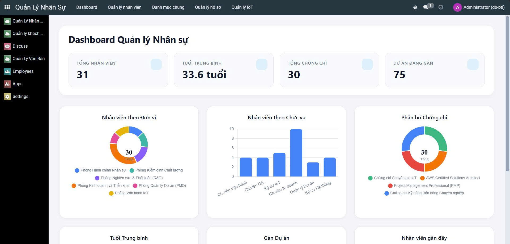
</div>

Dashboard được xây dựng nhằm cung cấp cái nhìn tổng quan về dữ liệu nhân sự trong toàn doanh nghiệp.

Các thông tin thống kê bao gồm:

* Tổng số nhân viên.
* Số lượng đơn vị.
* Số lượng chức vụ.
* Thống kê nhân viên theo đơn vị.
* Thống kê nhân viên theo chức vụ.
* Danh sách nhân viên mới.
* Danh sách nhân viên vừa cập nhật.
* Các chỉ số tổng hợp phục vụ quản trị.

Dashboard giúp nhà quản lý nhanh chóng nắm bắt tình hình nguồn nhân lực và đưa ra quyết định điều phối nhân sự phù hợp.

---

# 6.1.5 Luồng nghiệp vụ

```
                         QUẢN LÝ NHÂN SỰ

          Tạo đơn vị
               │
               ▼
         Khởi tạo chức vụ
               │
               ▼
        Tạo hồ sơ nhân viên
               │
               ▼
     Gán đơn vị và chức vụ
               │
               ▼
      Tạo thư mục hồ sơ điện tử
               │
               ▼
      Cập nhật lịch sử công tác
               │
               ▼
      Cập nhật chứng chỉ, bằng cấp
               │
               ▼
 Dashboard thống kê và quản lý
```

### Mô tả quy trình

**Bước 1. Khởi tạo đơn vị**

Quản trị viên tạo danh sách đơn vị trong doanh nghiệp như Phòng Kỹ thuật, Phòng Kinh doanh, Phòng Hành chính,...

---

**Bước 2. Khởi tạo chức vụ**

Danh mục chức vụ được xây dựng để phục vụ việc phân công nhân viên.

---

**Bước 3. Tạo hồ sơ nhân viên**

Người quản trị nhập các thông tin cá nhân của nhân viên gồm họ tên, email, số điện thoại, ngày sinh và ngày vào làm.

---

**Bước 4. Phân công đơn vị và chức vụ**

Nhân viên được liên kết với đơn vị và chức vụ tương ứng thông qua các khóa ngoại trong cơ sở dữ liệu.

---

**Bước 5. Tạo hồ sơ điện tử**

Hệ thống tạo hoặc gán thư mục lưu trữ hồ sơ điện tử nhằm quản lý tập trung các tài liệu liên quan đến nhân viên.

---

**Bước 6. Cập nhật lịch sử công tác**

Trong quá trình làm việc, các thay đổi về vị trí hoặc đơn vị công tác được lưu trong bảng `lich_su_cong_tac`.

---

**Bước 7. Cập nhật chứng chỉ**

Các chứng chỉ chuyên môn hoặc bằng cấp của nhân viên được quản lý riêng, cho phép theo dõi thời gian cấp và đơn vị cấp.

---

**Bước 8. Dashboard**

Toàn bộ dữ liệu được tổng hợp để hiển thị trên Dashboard, hỗ trợ nhà quản lý theo dõi cơ cấu nhân sự và thống kê tổng quan.

---

# 6.1.6 Giao diện quản lý nhân viên

<div align="center">
    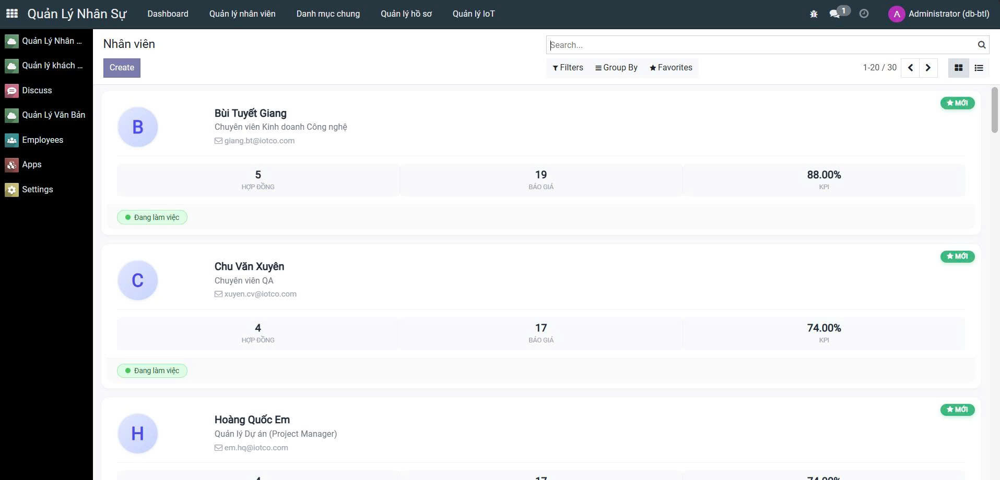
</div>

Giao diện quản lý nhân viên được xây dựng theo chuẩn của Odoo với các chức năng:

* Thêm mới hồ sơ nhân viên.
* Chỉnh sửa thông tin nhân viên.
* Tìm kiếm theo họ tên, email hoặc đơn vị.
* Lọc dữ liệu theo đơn vị và chức vụ.
* Sắp xếp danh sách.
* Xem chi tiết hồ sơ.
* Quản lý lịch sử công tác.
* Quản lý chứng chỉ.
* Truy cập nhanh hồ sơ điện tử.
* Điều hướng tới Dashboard thống kê.


# 6.2 Module Quản lý khách hàng

## 6.2.1 Mục tiêu

Module **Quản lý khách hàng (Customer Management Module)** được xây dựng nhằm hỗ trợ doanh nghiệp quản lý toàn bộ thông tin khách hàng và quá trình giao dịch từ khi tiếp nhận yêu cầu đến khi ký kết hợp đồng. Module cho phép lưu trữ lịch sử làm việc với khách hàng, quản lý báo giá, hợp đồng, lịch hẹn và các hoạt động tương tác, giúp doanh nghiệp theo dõi xuyên suốt vòng đời của từng khách hàng.

Thông qua module này, doanh nghiệp có thể:

* Quản lý danh sách khách hàng tập trung.
* Theo dõi lịch sử tương tác với khách hàng.
* Quản lý báo giá và các dòng chi tiết báo giá.
* Quản lý hợp đồng.
* Quản lý lịch hẹn làm việc.
* Liên kết dữ liệu với Module Quản lý văn bản để lưu trữ các tài liệu phát sinh.

---

# 6.2.2 Các chức năng chính

| Chức năng              | Mô tả                                                                   |
| ---------------------- | ----------------------------------------------------------------------- |
| **Quản lý khách hàng** | Lưu trữ thông tin khách hàng, thông tin liên hệ và nhân viên phụ trách. |
| **Quản lý báo giá**    | Tạo và quản lý các báo giá dành cho khách hàng.                         |
| **Chi tiết báo giá**   | Quản lý danh sách sản phẩm hoặc dịch vụ trong từng báo giá.             |
| **Quản lý hợp đồng**   | Quản lý hợp đồng được tạo từ quá trình giao dịch với khách hàng.        |
| **Lịch hẹn**           | Quản lý các lịch hẹn làm việc với khách hàng.                           |
| **Lịch sử tương tác**  | Ghi nhận các hoạt động trao đổi giữa nhân viên và khách hàng.           |
| **Dashboard**          | Thống kê tổng quan hoạt động chăm sóc khách hàng và giao dịch.          |

---

# 6.2.3 Cấu trúc cơ sở dữ liệu

### Bảng `qlkh_customer`

Lưu thông tin khách hàng.

| Trường                 | Kiểu     | Mô tả               |
| ---------------------- | -------- | ------------------- |
| id                     | Integer  | Khóa chính          |
| ten_khach_hang         | Char     | Tên khách hàng      |
| ma_khach_hang          | Char     | Mã khách hàng       |
| email                  | Char     | Email               |
| dien_thoai             | Char     | Số điện thoại       |
| dia_chi                | Text     | Địa chỉ             |
| nhan_vien_phu_trach_id | Many2one | Nhân viên phụ trách |

---

### Bảng `qlkh_quotation`

Lưu thông tin báo giá.

| Trường       | Kiểu     | Mô tả        |
| ------------ | -------- | ------------ |
| id           | Integer  | Khóa chính   |
| customer_id  | Many2one | Khách hàng   |
| ngay_bao_gia | Date     | Ngày báo giá |
| tinh_trang   | Char     | Tình trạng   |
| ghi_chu      | Text     | Ghi chú      |

---

### Bảng `qlkh_quotation_line`

Lưu chi tiết các sản phẩm hoặc dịch vụ trong báo giá.

| Trường           | Kiểu     | Mô tả                     |
| ---------------- | -------- | ------------------------- |
| id               | Integer  | Khóa chính                |
| quotation_id     | Many2one | Báo giá                   |
| san_pham_dich_vu | Char     | Tên sản phẩm hoặc dịch vụ |
| mo_ta            | Text     | Mô tả                     |
| so_luong         | Integer  | Số lượng                  |
| don_gia          | Float    | Đơn giá                   |
| thanh_tien       | Float    | Thành tiền                |

---

### Bảng `qlkh_contract`

Lưu thông tin hợp đồng.

| Trường        | Kiểu     | Mô tả            |
| ------------- | -------- | ---------------- |
| id            | Integer  | Khóa chính       |
| customer_id   | Many2one | Khách hàng       |
| quotation_id  | Many2one | Báo giá          |
| so_hop_dong   | Char     | Số hợp đồng      |
| ngay_ky       | Date     | Ngày ký          |
| ngay_hieu_luc | Date     | Ngày hiệu lực    |
| ngay_het_han  | Date     | Ngày hết hạn     |
| tinh_trang    | Char     | Tình trạng       |
| gia_tri       | Float    | Giá trị hợp đồng |
| ghi_chu       | Text     | Ghi chú          |

---

### Bảng `qlkh_customer_interaction`

Lưu lịch sử tương tác với khách hàng.

| Trường          | Kiểu     |
| --------------- | -------- |
| id              | Integer  |
| customer_id     | Many2one |
| ngay_tuong_tac  | Date     |
| loai_tuong_tac  | Char     |
| noi_dung        | Text     |
| nguoi_tuong_tac | Char     |
| ghi_chu         | Text     |

---

### Bảng `qlkh_appointment`

Lưu lịch hẹn với khách hàng.

| Trường          | Kiểu     |
| --------------- | -------- |
| id              | Integer  |
| customer_id     | Many2one |
| ngay_hen        | Date     |
| vai_dung        | Char     |
| nguoi_phu_trach | Char     |
| tinh_trang      | Char     |
| ghi_chu         | Text     |

---

# 6.2.4 Dashboard Quản lý khách hàng

<div align="center">
    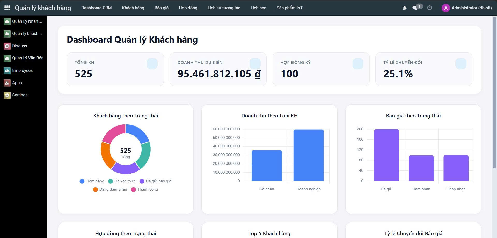
</div>

Dashboard cung cấp cái nhìn tổng quan về toàn bộ dữ liệu khách hàng trong hệ thống.

Các thông tin được thống kê bao gồm:

* Tổng số khách hàng.
* Tổng số báo giá.
* Tổng số hợp đồng.
* Tổng số lịch hẹn.
* Tổng số lượt tương tác.
* Thống kê khách hàng theo nhân viên phụ trách.
* Thống kê báo giá theo tình trạng.
* Thống kê hợp đồng theo tình trạng.
* Danh sách khách hàng mới.
* Danh sách lịch hẹn sắp diễn ra.

Dashboard hỗ trợ nhà quản lý theo dõi hoạt động kinh doanh, đánh giá tiến độ xử lý khách hàng và đưa ra kế hoạch chăm sóc phù hợp.

---

# 6.2.5 Luồng nghiệp vụ

```text
                  QUẢN LÝ KHÁCH HÀNG

             Tạo khách hàng
                   │
                   ▼
        Phân công nhân viên phụ trách
                   │
                   ▼
              Tạo báo giá
                   │
                   ▼
      Thêm các sản phẩm/dịch vụ
                   │
                   ▼
            Theo dõi báo giá
                   │
                   ▼
              Tạo hợp đồng
                   │
                   ▼
          Ghi nhận lịch hẹn
                   │
                   ▼
      Ghi nhận lịch sử tương tác
                   │
                   ▼
       Dashboard thống kê và báo cáo
```

### Mô tả quy trình

**Bước 1. Khởi tạo khách hàng**

Nhân viên nhập thông tin khách hàng vào hệ thống gồm tên, mã khách hàng, địa chỉ, email, số điện thoại và nhân viên phụ trách.

---

**Bước 2. Tạo báo giá**

Khi phát sinh nhu cầu giao dịch, nhân viên tạo báo giá cho khách hàng và nhập các thông tin cơ bản của báo giá.

---

**Bước 3. Khai báo chi tiết báo giá**

Mỗi báo giá có thể bao gồm nhiều sản phẩm hoặc dịch vụ. Hệ thống lưu từng dòng báo giá trong bảng `quotation_line`, bao gồm số lượng, đơn giá và thành tiền.

---

**Bước 4. Tạo hợp đồng**

Sau khi quá trình trao đổi hoàn tất, báo giá có thể được sử dụng để tạo hợp đồng giữa doanh nghiệp và khách hàng. Hợp đồng được liên kết với khách hàng và báo giá tương ứng.

---

**Bước 5. Quản lý lịch hẹn**

Trong quá trình chăm sóc khách hàng, nhân viên có thể tạo các lịch hẹn để theo dõi các buổi làm việc hoặc trao đổi trực tiếp.

---

**Bước 6. Ghi nhận lịch sử tương tác**

Mọi hoạt động trao đổi như gặp mặt, điện thoại hoặc trao đổi trực tiếp được lưu vào bảng `customer_interaction`, giúp doanh nghiệp theo dõi toàn bộ lịch sử làm việc với khách hàng.

---

**Bước 7. Tổng hợp Dashboard**

Toàn bộ dữ liệu khách hàng, báo giá, hợp đồng, lịch hẹn và lịch sử tương tác được tổng hợp trên Dashboard nhằm hỗ trợ nhà quản lý theo dõi tình hình kinh doanh và hiệu quả chăm sóc khách hàng.

---

# 6.2.6 Giao diện quản lý khách hàng

<div align="center">
    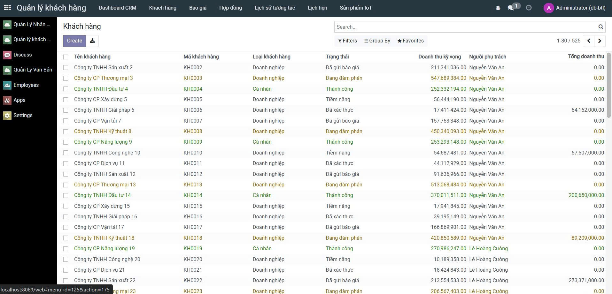
</div>

Giao diện quản lý khách hàng được xây dựng theo chuẩn Form View của Odoo, cho phép người dùng quản lý toàn bộ thông tin liên quan đến khách hàng trên một giao diện thống nhất.

Các chức năng chính bao gồm:

* Thêm mới và cập nhật thông tin khách hàng.
* Tìm kiếm theo tên, mã khách hàng hoặc nhân viên phụ trách.
* Quản lý báo giá của khách hàng.
* Theo dõi danh sách hợp đồng.
* Quản lý lịch hẹn.
* Theo dõi lịch sử tương tác.
* Điều hướng nhanh tới Dashboard thống kê.

# 6.3 Module Quản lý văn bản

## 6.3.1 Mục tiêu

Module **Quản lý văn bản (Document Management Module)** được xây dựng nhằm số hóa quá trình lưu trữ và quản lý tài liệu trong doanh nghiệp. Thay vì lưu trữ văn bản rời rạc, hệ thống cho phép quản lý tập trung toàn bộ văn bản đến, văn bản đi, hồ sơ giao dịch và các tài liệu liên quan đến khách hàng, hợp đồng và nhân sự.

Module được thiết kế để hỗ trợ theo dõi vòng đời của một văn bản từ khi được tạo lập đến khi hoàn thành xử lý, đồng thời lưu lại lịch sử chỉnh sửa và quá trình phê duyệt nhằm đảm bảo tính toàn vẹn của dữ liệu.

Thông qua module này doanh nghiệp có thể:

* Quản lý tập trung toàn bộ văn bản.
* Quản lý văn bản đến và văn bản đi.
* Theo dõi lịch sử phiên bản của tài liệu.
* Quản lý quy trình phê duyệt.
* Quản lý thư mục lưu trữ.
* Liên kết văn bản với khách hàng, nhân viên, báo giá và hợp đồng.
* Hỗ trợ Dashboard thống kê tình trạng xử lý văn bản.

---

# 6.3.2 Các chức năng chính

| Chức năng             | Mô tả                                                               |
| --------------------- | ------------------------------------------------------------------- |
| **Quản lý văn bản**   | Quản lý thông tin chung của toàn bộ tài liệu trong hệ thống.        |
| **Văn bản đến**       | Quản lý các văn bản tiếp nhận từ bên ngoài.                         |
| **Văn bản đi**        | Quản lý các văn bản phát hành từ doanh nghiệp.                      |
| **Quản lý phiên bản** | Lưu lịch sử chỉnh sửa của từng văn bản.                             |
| **Phê duyệt văn bản** | Theo dõi thông tin người duyệt, trạng thái và quyết định phê duyệt. |
| **Thư mục lưu trữ**   | Quản lý cây thư mục lưu trữ hồ sơ điện tử.                          |
| **Dashboard**         | Thống kê tình trạng xử lý văn bản và hoạt động của hệ thống.        |

---

# 6.3.3 Cấu trúc cơ sở dữ liệu

Module Quản lý văn bản được xây dựng xoay quanh bảng trung tâm `van_ban_document`, từ đó liên kết tới các bảng nghiệp vụ khác.

### Bảng `van_ban_document`

Lưu thông tin chung của tài liệu.

| Trường               | Kiểu     | Mô tả                |
| -------------------- | -------- | -------------------- |
| id                   | Integer  | Khóa chính           |
| ten_document         | Char     | Tên văn bản          |
| so_ky_hieu           | Char     | Số ký hiệu           |
| ngay_ban_hanh        | Date     | Ngày ban hành        |
| noi_dung             | Text     | Nội dung             |
| mo_ta                | Text     | Mô tả                |
| customer_id          | Many2one | Khách hàng liên quan |
| nhan_vien_id         | Many2one | Nhân viên phụ trách  |
| folder_id            | Many2one | Thư mục lưu trữ      |
| related_contract_id  | Many2one | Hợp đồng liên quan   |
| related_quotation_id | Many2one | Báo giá liên quan    |

---

### Bảng `van_ban_den`

Lưu thông tin văn bản đến.

| Trường      | Kiểu     | Mô tả         |
| ----------- | -------- | ------------- |
| id          | Integer  | Khóa chính    |
| document_id | Many2one | Văn bản       |
| so_den      | Char     | Số đến        |
| ngay_den    | Date     | Ngày đến      |
| nguoi_gui   | Char     | Người gửi     |
| trich_yeu   | Text     | Trích yếu     |
| file_path   | Char     | Đường dẫn tệp |
| ghi_chu     | Text     | Ghi chú       |

---

### Bảng `van_ban_di`

Lưu thông tin văn bản đi.

| Trường      | Kiểu     | Mô tả         |
| ----------- | -------- | ------------- |
| id          | Integer  | Khóa chính    |
| document_id | Many2one | Văn bản       |
| so_di       | Char     | Số đi         |
| ngay_di     | Date     | Ngày gửi      |
| noi_nhan    | Char     | Nơi nhận      |
| trich_yeu   | Text     | Trích yếu     |
| file_path   | Char     | Đường dẫn tệp |
| ghi_chu     | Text     | Ghi chú       |

---

### Bảng `van_ban_version`

Lưu lịch sử phiên bản.

| Trường            | Kiểu     |
| ----------------- | -------- |
| id                | Integer  |
| document_id       | Many2one |
| version           | Integer  |
| ngay_tao          | Date     |
| noi_dung_thay_doi | Text     |
| file_path         | Char     |
| nguoi_tao         | Char     |
| ghi_chu           | Text     |

---

### Bảng `van_ban_approval`

Lưu thông tin phê duyệt.

| Trường      | Kiểu     |
| ----------- | -------- |
| id          | Integer  |
| document_id | Many2one |
| nguoi_duyet | Char     |
| vai_tro     | Char     |
| ngay_duyet  | Date     |
| quyet_dinh  | Char     |
| ghi_chu     | Text     |

---

# 6.3.4 Dashboard Quản lý văn bản

<div align="center">
    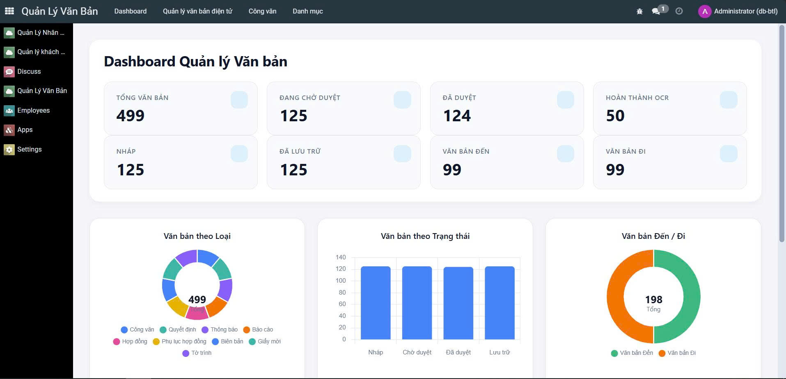
</div>

Dashboard Quản lý văn bản cung cấp thông tin tổng quan về toàn bộ tài liệu trong hệ thống.

Các nội dung thống kê bao gồm:

* Tổng số văn bản.
* Tổng số văn bản đến.
* Tổng số văn bản đi.
* Tổng số văn bản đang xử lý.
* Tổng số văn bản đã phê duyệt.
* Thống kê theo loại văn bản.
* Thống kê theo trạng thái xử lý.
* Danh sách văn bản mới.
* Danh sách văn bản gần đây.

Dashboard giúp nhà quản lý nhanh chóng theo dõi khối lượng tài liệu, tiến độ xử lý và tình trạng lưu trữ của doanh nghiệp.

---

# 6.3.5 Luồng nghiệp vụ

```text
                    QUẢN LÝ VĂN BẢN

                Tạo văn bản mới
                      │
                      ▼
          Khai báo thông tin chung
                      │
                      ▼
       Liên kết khách hàng / nhân viên
                      │
                      ▼
      Liên kết báo giá hoặc hợp đồng
                      │
                      ▼
          Phân loại văn bản đến/đi
                      │
                      ▼
         Tạo phiên bản đầu tiên
                      │
                      ▼
          Thực hiện phê duyệt
                      │
                      ▼
      Cập nhật lịch sử phiên bản
                      │
                      ▼
      Dashboard thống kê và quản lý
```

### Mô tả quy trình

### Bước 1. Tạo văn bản

Người dùng tạo một bản ghi mới trong bảng `van_ban_document` và nhập các thông tin cơ bản như tên văn bản, số ký hiệu, ngày ban hành và nội dung.

---

### Bước 2. Liên kết dữ liệu nghiệp vụ

Tài liệu có thể được liên kết với:

* Khách hàng
* Nhân viên
* Báo giá
* Hợp đồng

để phục vụ việc tra cứu và quản lý tập trung.

---

### Bước 3. Quản lý văn bản đến hoặc văn bản đi

Tùy theo loại tài liệu, hệ thống tạo bản ghi trong bảng `van_ban_den` hoặc `van_ban_di`, lưu các thông tin đặc thù như số đến, số đi, người gửi hoặc nơi nhận.

---

### Bước 4. Quản lý phiên bản

Mỗi lần chỉnh sửa tài liệu, hệ thống lưu một bản ghi trong bảng `van_ban_version`, giúp theo dõi lịch sử thay đổi của văn bản theo từng phiên bản.

---

### Bước 5. Phê duyệt

Quá trình phê duyệt được ghi nhận trong bảng `van_ban_approval`, bao gồm người duyệt, vai trò, ngày duyệt và quyết định phê duyệt.

---

### Bước 6. Dashboard

Sau khi dữ liệu được cập nhật, Dashboard sẽ tự động tổng hợp các chỉ số thống kê phục vụ công tác quản lý.

---

# 6.3.6 Giao diện quản lý văn bản

<div align="center">
    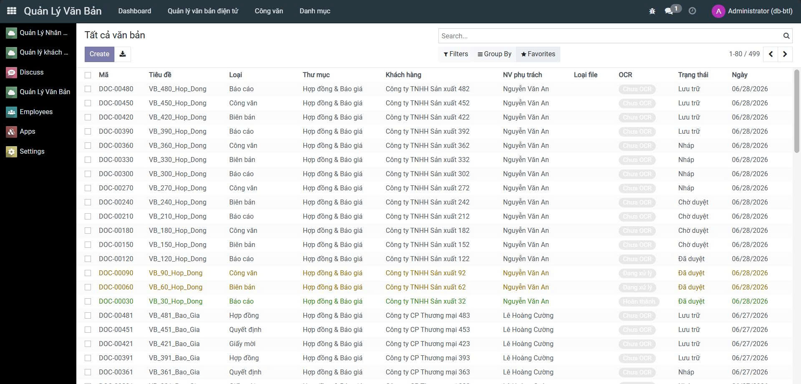
</div>

Giao diện quản lý văn bản được xây dựng theo chuẩn Form View và Tree View của Odoo, hỗ trợ người dùng quản lý toàn bộ vòng đời của tài liệu.

Các chức năng chính bao gồm:

* Tạo mới văn bản.
* Chỉnh sửa thông tin văn bản.
* Tìm kiếm theo tên, số ký hiệu hoặc khách hàng.
* Lọc theo loại văn bản.
* Theo dõi lịch sử phiên bản.
* Theo dõi quá trình phê duyệt.
* Liên kết nhanh tới khách hàng, hợp đồng và báo giá.
* Truy cập Dashboard thống kê.

---

# 🤖 7. Tích hợp AI và API

## 7.1. Mục tiêu tích hợp

Bên cạnh các chức năng quản lý nghiệp vụ truyền thống, PLATFORM ERP được thiết kế theo hướng mở, cho phép tích hợp các công nghệ AI và các dịch vụ API bên ngoài nhằm tự động hóa quy trình làm việc, nâng cao hiệu quả quản lý và giảm thiểu các thao tác thủ công.

Các thành phần tích hợp chính của hệ thống bao gồm:

* **OCR và AI**: Hỗ trợ trích xuất nội dung từ tài liệu số, phân tích và tóm tắt văn bản phục vụ lưu trữ và tra cứu.
* **Telegram API**: Gửi thông báo tự động khi có sự kiện quan trọng như tạo mới, cập nhật hoặc phê duyệt văn bản.
* **Email API**: Gửi thông báo tới khách hàng hoặc nhân viên trong các quy trình báo giá, hợp đồng và xử lý văn bản.
* **Google Meet API**: Hỗ trợ tạo liên kết họp trực tuyến phục vụ trao đổi với khách hàng.
* **Workflow Integration**: Đồng bộ dữ liệu giữa các module Quản lý khách hàng và Quản lý văn bản nhằm đảm bảo tính nhất quán của hệ thống.

<div align="center">
    
    <br /><b>Hình 7.1. Kiến trúc tích hợp AI và API trong PLATFORM ERP</b>
</div>

---

# 7.2. Kiến trúc tích hợp

Hệ thống được xây dựng theo mô hình tích hợp mở, trong đó các module nghiệp vụ đóng vai trò trung tâm và có thể giao tiếp với các dịch vụ bên ngoài thông qua API.

Quá trình xử lý bắt đầu từ các thao tác của người dùng trên hệ thống ERP. Tùy theo từng nghiệp vụ, dữ liệu sẽ được chuyển tới các dịch vụ AI hoặc API phù hợp để thực hiện xử lý, sau đó kết quả được đồng bộ trở lại cơ sở dữ liệu và hiển thị trên giao diện người dùng.

Các luồng tích hợp chính bao gồm:

* Trích xuất và xử lý nội dung tài liệu bằng OCR và AI.
* Gửi thông báo qua Telegram và Email.
* Tạo cuộc họp trực tuyến thông qua Google Meet.
* Đồng bộ dữ liệu giữa báo giá, hợp đồng và văn bản.
* Cập nhật Dashboard sau khi dữ liệu thay đổi.

---

# 7.3. Các dịch vụ tích hợp

| Thành phần               | Vai trò                                                                |
| ------------------------ | ---------------------------------------------------------------------- |
| **OCR**                  | Trích xuất nội dung từ tài liệu PDF hoặc hình ảnh.                     |
| **AI**                   | Hỗ trợ phân tích và tóm tắt nội dung văn bản.                          |
| **Telegram API**         | Gửi thông báo tự động cho người dùng khi phát sinh sự kiện quan trọng. |
| **Email API**            | Gửi email thông báo tới khách hàng và nhân viên.                       |
| **Google Meet API**      | Tạo liên kết họp trực tuyến trong quá trình trao đổi với khách hàng.   |
| **Workflow Integration** | Đồng bộ dữ liệu giữa các module ERP.                                   |

---

# 7.4. Kết quả tích hợp AI và API

Phần này trình bày các kết quả thực tế sau khi hệ thống được tích hợp với các dịch vụ AI và API bên ngoài. Những hình ảnh dưới đây minh họa quá trình hoạt động của hệ thống trong từng nghiệp vụ cụ thể.

---

Các dịch vụ API được sử dụng nhằm tự động hóa quá trình trao đổi thông tin giữa hệ thống ERP và các nền tảng bên ngoài. Khi người dùng thực hiện các thao tác như tạo văn bản, cập nhật hợp đồng hoặc xử lý báo giá, hệ thống sẽ tự động gửi thông báo hoặc tạo các dịch vụ liên quan mà không cần thao tác thủ công.

Bạn có thể trình bày lần lượt các hình ảnh như sau:

### Gửi thông báo qua Telegram

<div align="center">
    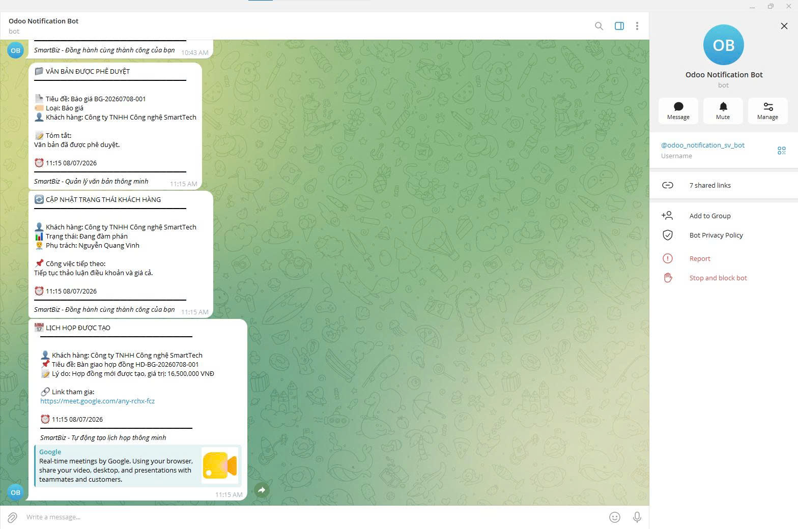
    <br /><b>Hình 7.2. Kết quả gửi thông báo qua Telegram</b>
</div>

---

### Gửi Email tự động

<div align="center">
<table cellspacing="20" cellpadding="0" style="border: none; width: 100%; max-width: 1000px;">
  <tr>
    <td align="center" style="border: none; width: 50%;">
        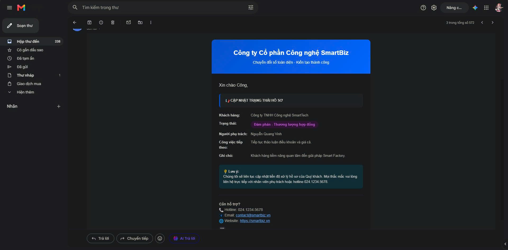
    </td>
    <td align="center" style="border: none; width: 50%;">
        
    </td>
  </tr>
  <tr>
    <td align="center" style="border: none; width: 50%;">
        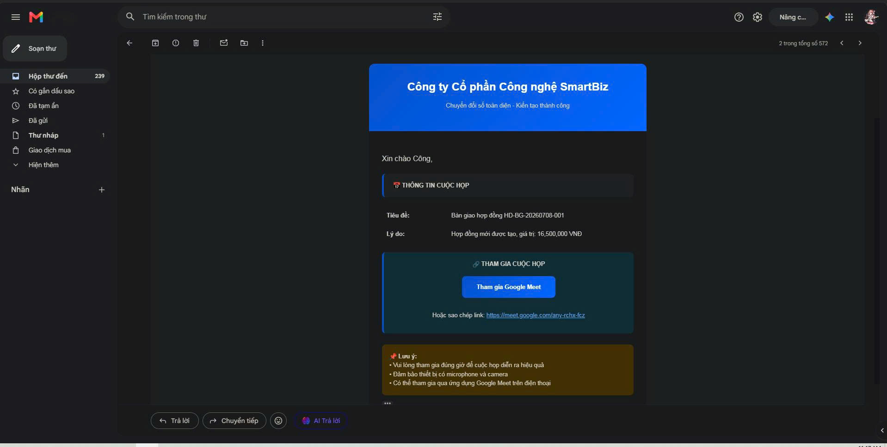
    </td>
    <td align="center" style="border: none; width: 50%;">
        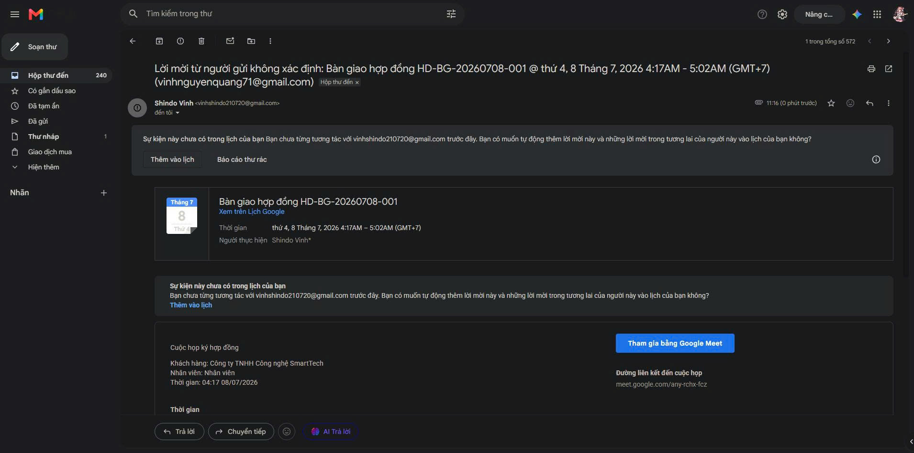
    </td>
  </tr>
</table>
<br />
<b>Hình 7.3. Kết quả gửi Email tự động</b>
</div>

---

### Tạo cuộc họp Google Meet

<div align="center">
    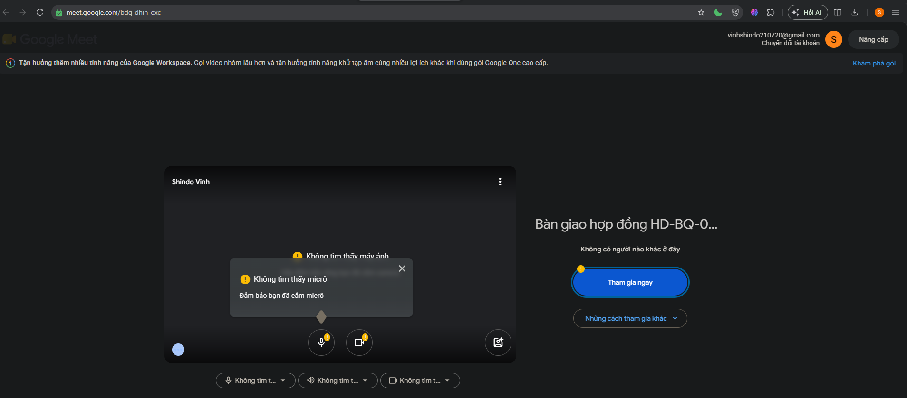
    <br /><b>Hình 7.4. Kết quả tạo cuộc họp Google Meet</b>
</div>

---

## 💾 8. Thiết kế cơ sở dữ liệu

### 8.1. Sơ đồ quan hệ tổng thể

<div align="center">
    
</div>

*Mô hình CSDL được thiết kế gồm 3 nhóm module chính: Quản lý nhân sự (1), Quản lý khách hàng (2) và Quản lý văn bản/tài liệu (3).*

### 8.2. Giải thích các mối quan hệ

| Mối quan hệ | Loại | Giải thích chi tiết |
| :--- | :--- | :--- |
| **Module 1: Quản lý nhân sự** | | |
| `don_vi` → `hr_employee` | 1 - N | Mỗi đơn vị (`don_vi`) có nhiều nhân viên thuộc biên chế. |
| `chuc_vu` → `hr_employee` | 1 - N | Mỗi chức vụ (`chuc_vu`) có nhiều nhân viên nắm giữ. |
| `hr_employee` → `lich_su_cong_tac` | 1 - N | Một nhân viên (`hr_employee`) có thể có nhiều dòng lịch sử công tác. |
| `hr_employee` → `danh_sach_chung_chi_bang_cap` | 1 - N | Một nhân viên sở hữu nhiều chứng chỉ/bằng cấp (thể hiện qua danh sách cấp). |
| `chung_chi_bang_cap` → `danh_sach_chung_chi_bang_cap` | 1 - N | Mỗi loại chứng chỉ/bằng cấp có thể được cấp cho nhiều nhân viên khác nhau. |
| `van_ban_folder` (tự tham chiếu) | 1 - N | Một thư mục cha có thể chứa nhiều thư mục con dựa trên `parent_id`. |
| `van_ban_folder` → `hr_employee` | 1 - N | Một thư mục tài liệu cá nhân chứa tài liệu của nhiều nhân viên (qua `folder_id`). |
| **Module 2: Quản lý khách hàng** | | |
| `hr_employee` → `qlkh_customer` | 1 - N | Một nhân viên phụ trách (`nhan_vien_phu_trach_id`) nhiều khách hàng. |
| `qlkh_customer` → `qlkh_customer_interaction` | 1 - N | Một khách hàng (`qlkh_customer`) có nhiều lịch sử tương tác. |
| `qlkh_customer` → `qlkh_appointment` | 1 - N | Một khách hàng có nhiều cuộc hẹn làm việc. |
| `qlkh_customer` → `qlkh_quotation` | 1 - N | Một khách hàng có nhiều báo giá (`qlkh_quotation`). |
| `qlkh_quotation` → `qlkh_quotation_line` | 1 - N | Một báo giá có nhiều dòng sản phẩm/dịch vụ chi tiết. |
| `qlkh_customer` → `qlkh_contract` | 1 - N | Một khách hàng có thể ký kết nhiều hợp đồng. |
| `qlkh_quotation` → `qlkh_contract` | 1 - 1 | Một báo giá được xác nhận sẽ tạo ra một hợp đồng tương ứng. |
| **Module 3: Quản lý văn bản tài liệu** | | |
| `van_ban_folder` → `van_ban_document` | 1 - N | Một thư mục có thể chứa nhiều văn bản/tài liệu. |
| `hr_employee` → `van_ban_document` | 1 - N | Một nhân viên có thể tạo ra/ là người soạn thảo nhiều tài liệu. |
| `qlkh_customer` → `van_ban_document` | 1 - N | Một khách hàng có thể có nhiều văn bản, tài liệu liên quan. |
| `qlkh_contract` → `van_ban_document` | 1 - N | Một hợp đồng có thể có nhiều tài liệu đính kèm hoặc phụ lục. |
| `qlkh_quotation` → `van_ban_document` | 1 - N | Một báo giá có thể có nhiều tài liệu đính kèm hoặc phụ lục. |
| `van_ban_document` → `van_ban_version` | 1 - N | Một tài liệu có thể có nhiều phiên bản chỉnh sửa theo thời gian. |
| `van_ban_document` → `van_ban_approval` | 1 - N | Một tài liệu cần trải qua nhiều lần phê duyệt. |
| `van_ban_document` → `van_ban_den` | 1 - 1 | Một tài liệu (đầu vào) có thể tương ứng với một văn bản đến. |
| `van_ban_document` → `van_ban_di` | 1 - 1 | Một tài liệu (đầu ra) có thể tương ứng với một văn bản đi. |

### 8.3. Các chỉ mục (Indexes) quan trọng

```sql
-- 1. Tối ưu truy vấn module Quản lý nhân sự
CREATE INDEX idx_hr_employee_don_vi ON hr_employee(don_vi_id);
CREATE INDEX idx_hr_employee_chuc_vu ON hr_employee(chuc_vu_id);
CREATE INDEX idx_hr_employee_folder ON hr_employee(folder_id);
CREATE INDEX idx_lich_su_cong_tac_nhan_vien ON lich_su_cong_tac(nhan_vien_id);
CREATE INDEX idx_chung_chi_cap_cho_nhan_vien ON danh_sach_chung_chi_bang_cap(nhan_vien_id);

-- 2. Tối ưu truy vấn module Quản lý khách hàng
CREATE INDEX idx_khach_hang_nguoi_phu_trach ON qlkh_customer(nhan_vien_phu_trach_id);
CREATE INDEX idx_tuong_tac_khach_hang ON qlkh_customer_interaction(customer_id);
CREATE INDEX idx_cuoc_hen_khach_hang ON qlkh_appointment(customer_id);
CREATE INDEX idx_bao_gia_khach_hang ON qlkh_quotation(customer_id);
CREATE INDEX idx_hop_dong_khach_hang ON qlkh_contract(customer_id);
CREATE INDEX idx_hop_dong_bao_gia ON qlkh_contract(quotation_id);
CREATE INDEX idx_bao_gia_chi_tiet ON qlkh_quotation_line(quotation_id);

-- 3. Tối ưu truy vấn module Quản lý văn bản tài liệu
CREATE INDEX idx_document_folder ON van_ban_document(folder_id);
CREATE INDEX idx_document_nguoi_tao ON van_ban_document(nhan_vien_id);
CREATE INDEX idx_document_khach_hang ON van_ban_document(customer_id);
CREATE INDEX idx_document_hop_dong ON van_ban_document(related_contract_id);
CREATE INDEX idx_document_bao_gia ON van_ban_document(related_quotation_id);
CREATE INDEX idx_document_loai ON van_ban_document(loai_document);

CREATE INDEX idx_version_document ON van_ban_version(document_id);
CREATE INDEX idx_approval_document ON van_ban_approval(document_id);
CREATE INDEX idx_approval_nguoi_duyet ON van_ban_approval(nguoi_duyet);

CREATE INDEX idx_van_ban_den_document ON van_ban_den(document_id);
CREATE INDEX idx_van_ban_di_document ON van_ban_di(document_id);
```

---

## 🔒 9. Bảo mật và phân quyền

### 9.1. Mô hình phân quyền

Hệ thống sử dụng mô hình RBAC (Role-Based Access Control) với các nhóm người dùng:

| Nhóm người dùng | Quyền hạn |
|-----------------|-----------|
| **Administrator** | Toàn quyền trên tất cả module, cấu hình hệ thống |
| **Manager** | Quyền xem, tạo, sửa, xóa dữ liệu trong phòng ban quản lý |
| **HR** | Quyền quản lý nhân sự (thêm, sửa, xóa nhân viên) |
| **Sale** | Quyền quản lý khách hàng, báo giá, hợp đồng, lịch hẹn |
| **Support** | Quyền xem khách hàng, tạo lịch hẹn, ghi nhận tương tác |
| **User** | Quyền xem văn bản, tạo văn bản, gửi phê duyệt |
| **Approver** | Quyền phê duyệt văn bản |

### 9.2. Kiểm soát truy cập dữ liệu

- **Record Rules**: Người dùng chỉ xem được dữ liệu trong phòng ban của mình (trừ Admin)
- **Field-level Security**: Các trường nhạy cảm (lương, thông tin cá nhân) chỉ hiển thị với HR và Admin
- **Audit Log**: Ghi nhận tất cả thao tác quan trọng (tạo, sửa, xóa, phê duyệt)

### 9.3. Security Configuration (`ir.model.access.csv`)

```
id,name,model_id:id,group_id:id,perm_read,perm_write,perm_create,perm_unlink
access_nhan_su_phong_ban_user,access_nhan_su_phong_ban_user,model_nhan_su_phong_ban,group_user,1,0,0,0
access_nhan_su_phong_ban_manager,access_nhan_su_phong_ban_manager,model_nhan_su_phong_ban,group_manager,1,1,1,1
access_nhan_su_nhan_vien_user,access_nhan_su_nhan_vien_user,model_nhan_su_nhan_vien,group_user,1,0,0,0
access_nhan_su_nhan_vien_hr,access_nhan_su_nhan_vien_hr,model_nhan_su_nhan_vien,group_hr,1,1,1,1
access_qlkh_khach_hang_sale,access_qlkh_khach_hang_sale,model_qlkh_khach_hang,group_sale,1,1,1,1
access_qlkh_quotation_sale,access_qlkh_quotation_sale,model_qlkh_quotation,group_sale,1,1,1,1
access_van_ban_document_user,access_van_ban_document_user,model_van_ban_document,group_user,1,1,1,1
access_van_ban_den_user,access_van_ban_den_user,model_van_ban_den,group_user,1,1,1,1
access_van_ban_approval_approver,access_van_ban_approval_approver,model_van_ban_approval,group_approver,1,1,1,1
```

---

## 👥 10. Thành viên nhóm

| STT | Họ và tên | Vai trò | Mô tả công việc |
|-----|-----------|---------|-----------------|
| 1 | Nguyễn Quang Vinh | Trưởng nhóm | Quản lý dự án, thiết kế kiến trúc, tích hợp AI, phát triển module Khách hàng và tự động hóa |
| 2 | Phùng Mạnh Đức | Developer | Phát triển module Nhân sự và văn bản |
| 3 | Phạm Thành Vinh | Developer | Thiết kế giao diện, Dashboard  |

---

## 📝 11. License

© 2024 AIoTLab, Faculty of Information Technology, DaiNam University. All rights reserved.

---

## 📚 12. Tài liệu tham khảo

1. **Odoo Documentation**: https://www.odoo.com/documentation/
2. **Python Official Documentation**: https://docs.python.org/
3. **PostgreSQL Documentation**: https://www.postgresql.org/docs/
4. **Google Cloud Vision API**: https://cloud.google.com/vision
5. **Tesseract OCR**: https://github.com/tesseract-ocr/tesseract
6. **Gemini AI API**: https://ai.google.dev/
7. **Docker Documentation**: https://docs.docker.com/

---

*Phân tích nghiệp vụ chi tiết: [docs/business-flow/PHAN_TICH_NGHIEP_VU_3_MODULE.md](docs/business-flow/PHAN_TICH_NGHIEP_VU_3_MODULE.md)*

*Hướng dẫn sử dụng AI/API: [docs/business-flow/ai_api_use_cases.md](docs/business-flow/ai_api_use_cases.md)*